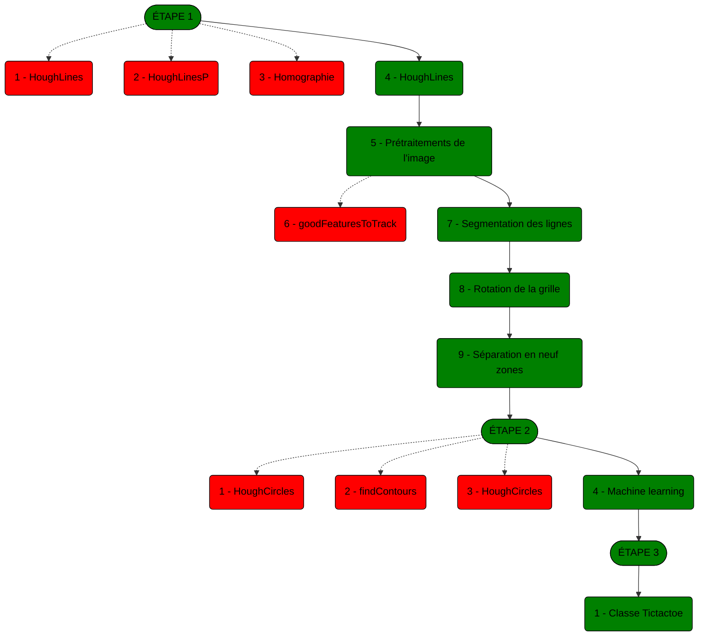

```mermaid
graph TD

classDef success fill:green,color:black,stroke:black
classDef failure fill:red,color:black,stroke:black

A([ÉTAPE 1])-.->B(1 - HoughLines)
A-.->C(2 - HoughLinesP)
A-.->D(3 - Homographie)
A-->E(4 - HoughLines)
E-->F(5 - Prétraitements de l'image)
F-.->G(6 - goodFeaturesToTrack)
F-->H(7 - Segmentation des lignes)
H-->I(8 - Rotation de la grille)
I-->J(9 - Séparation en neuf zones)
J-->K([ÉTAPE 2])
K-.->L(1 - HoughCircles)
K-.->M(2 - findContours)
K-.->N(3 - HoughCircles)
K-->O(4 - Machine learning)
O-->P([ÉTAPE 3])
P-->Q(1 - Classe Tictactoe)

class A,E,F,H,I,J,K,O,P,Q success
class B,C,D,G,L,M,N failure
```